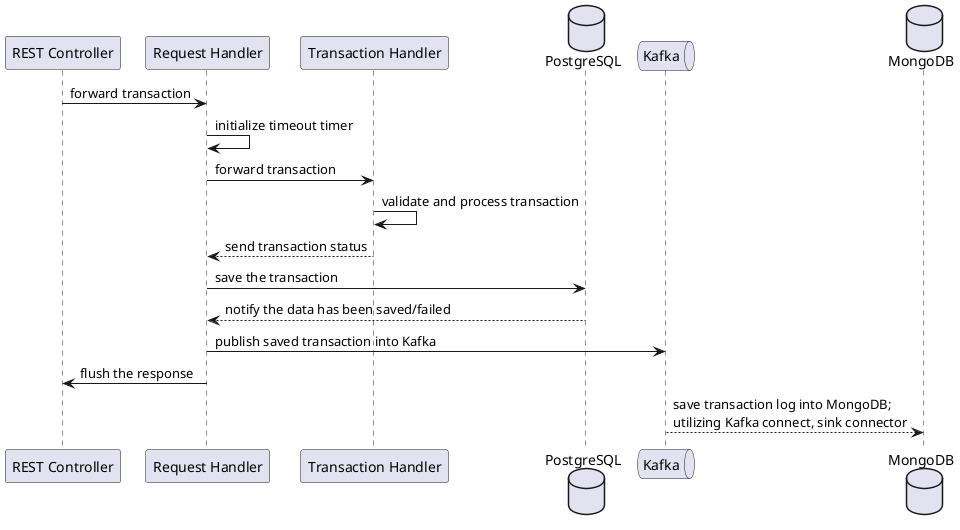

# Simpan Pinjam Simulation App

Parts of docker compose content are adapted
from [MongoDB Kafka Connector Quick Start for v1.6 of the connector](https://docs.mongodb.com/kafka-connector/v1.6/quick-start/)
.

## Prepare the environment first:

```shell
cd docker
docker images | grep quickstart | awk '{print $3}' | xargs docker rmi
docker-compose up

# open on another terminal
docker exec -it db bash -c 'psql -U postgres < /tmp/create-schema-data.sql'
# enter shell container to setup the kafka-mongodb sink connector and then check our data from mongo shell
docker exec -it shell bash

./initialize-container.sh

mongosh mongodb://mongo1:27017/?replicaSet=rs0
use quickstart
db.sink.find()

```

## Diving in

General flow:



It is worth mentioning that integration point of Spring Web and Akka is reactive pattern of Spring WebFlux against
asynchronous execution of Akka. You can see this in
the [controller](src/main/java/id/co/alamisharia/simjam/controller/SimjamController.java).

Please check [SimjamApplicationTests.java](src/test/java/id/co/alamisharia/simjam/SimjamApplicationTests.java) for the
integration test, also a simulation where concurrent test is done against multiple accounts try to make a deposit or
loan. A simulation was done where you can see an example of the output in [simulation.log](simulation.log). To check the
failed cases, you can run:

```shell
grep -e failed -e asked simulation.log
```

and you should see the following output:

```text
[INFO] [11/28/2021 19:31:18.131] [simjim-showcase-akka.actor.default-dispatcher-11] [akka://simjim-showcase/user/groupManager/random] Group random; user#5 asked for a loan 7000.0 while the current balance is 0.0
[INFO] [11/28/2021 19:31:18.131] [simjim-showcase-akka.actor.default-dispatcher-7] [akka://simjim-showcase/user/$e] account user#5 failed to make a loan 7000.0
[INFO] [11/28/2021 19:31:18.132] [simjim-showcase-akka.actor.default-dispatcher-11] [akka://simjim-showcase/user/groupManager/random] Group random; user#4 asked for a loan 7000.0 while the current balance is 0.0
[INFO] [11/28/2021 19:31:18.132] [simjim-showcase-akka.actor.default-dispatcher-8] [akka://simjim-showcase/user/$d] account user#4 failed to make a loan 7000.0
[INFO] [11/28/2021 19:31:18.132] [simjim-showcase-akka.actor.default-dispatcher-11] [akka://simjim-showcase/user/groupManager/random] Group random; user#1 asked for a loan 5000.0 while the current balance is 0.0
[INFO] [11/28/2021 19:31:18.132] [simjim-showcase-akka.actor.default-dispatcher-10] [akka://simjim-showcase/user/$a] account user#1 failed to make a loan 5000.0
[INFO] [11/28/2021 19:31:18.133] [simjim-showcase-akka.actor.default-dispatcher-11] [akka://simjim-showcase/user/groupManager/random] Group random; user#9 asked for a loan 6000.0 while the current balance is 2000.0
[INFO] [11/28/2021 19:31:18.133] [simjim-showcase-akka.actor.default-dispatcher-8] [akka://simjim-showcase/user/$i] account user#9 failed to make a loan 6000.0
[INFO] [11/28/2021 19:31:18.133] [simjim-showcase-akka.actor.default-dispatcher-11] [akka://simjim-showcase/user/groupManager/random] Group random; user#14 asked for a loan 5000.0 while the current balance is 0.0
[INFO] [11/28/2021 19:31:18.133] [simjim-showcase-akka.actor.default-dispatcher-10] [akka://simjim-showcase/user/$n] account user#14 failed to make a loan 5000.0
[INFO] [11/28/2021 19:31:18.133] [simjim-showcase-akka.actor.default-dispatcher-11] [akka://simjim-showcase/user/groupManager/random] Group random; user#16 asked for a loan 8000.0 while the current balance is 0.0
[INFO] [11/28/2021 19:31:18.133] [simjim-showcase-akka.actor.default-dispatcher-7] [akka://simjim-showcase/user/$p] account user#16 failed to make a loan 8000.0
[INFO] [11/28/2021 19:31:18.133] [simjim-showcase-akka.actor.default-dispatcher-11] [akka://simjim-showcase/user/groupManager/random] Group random; user#17 asked for a loan 7000.0 while the current balance is 0.0
[INFO] [11/28/2021 19:31:18.133] [simjim-showcase-akka.actor.default-dispatcher-4] [akka://simjim-showcase/user/$q] account user#17 failed to make a loan 7000.0
[INFO] [11/28/2021 19:31:18.133] [simjim-showcase-akka.actor.default-dispatcher-6] [akka://simjim-showcase/user/$r] account user#18 failed to make a loan 7000.0
[INFO] [11/28/2021 19:31:18.133] [simjim-showcase-akka.actor.default-dispatcher-11] [akka://simjim-showcase/user/groupManager/random] Group random; user#18 asked for a loan 7000.0 while the current balance is 0.0
[INFO] [11/28/2021 19:31:18.133] [simjim-showcase-akka.actor.default-dispatcher-11] [akka://simjim-showcase/user/groupManager/random] Group random; user#19 asked for a loan 8000.0 while the current balance is 0.0
[INFO] [11/28/2021 19:31:18.134] [simjim-showcase-akka.actor.default-dispatcher-6] [akka://simjim-showcase/user/$s] account user#19 failed to make a loan 8000.0
[INFO] [11/28/2021 19:31:18.134] [simjim-showcase-akka.actor.default-dispatcher-11] [akka://simjim-showcase/user/groupManager/random] Group random; user#20 asked for a loan 3000.0 while the current balance is 0.0
[INFO] [11/28/2021 19:31:18.134] [simjim-showcase-akka.actor.default-dispatcher-7] [akka://simjim-showcase/user/$t] account user#20 failed to make a loan 3000.0
[INFO] [11/28/2021 19:31:18.134] [simjim-showcase-akka.actor.default-dispatcher-11] [akka://simjim-showcase/user/groupManager/random] Group random; user#21 asked for a loan 4000.0 while the current balance is 0.0
[INFO] [11/28/2021 19:31:18.134] [simjim-showcase-akka.actor.default-dispatcher-10] [akka://simjim-showcase/user/$u] account user#21 failed to make a loan 4000.0
[INFO] [11/28/2021 19:31:18.135] [simjim-showcase-akka.actor.default-dispatcher-7] [akka://simjim-showcase/user/groupManager/random] Group random; user#43 asked for a loan 9000.0 while the current balance is 5000.0
[INFO] [11/28/2021 19:31:18.135] [simjim-showcase-akka.actor.default-dispatcher-8] [akka://simjim-showcase/user/$Q] account user#43 failed to make a loan 9000.0
[INFO] [11/28/2021 19:31:19.474] [simjim-showcase-akka.actor.default-dispatcher-13] [akka://simjim-showcase/user/groupManager/random] Group random; user#79 asked for a loan 9000.0 while the current balance is 3000.0
[INFO] [11/28/2021 19:31:19.474] [simjim-showcase-akka.actor.default-dispatcher-7] [akka://simjim-showcase/user/$ob] account user#79 failed to make a loan 9000.0
[INFO] [11/28/2021 19:31:19.494] [simjim-showcase-akka.actor.default-dispatcher-8] [akka://simjim-showcase/user/$+] account user#63 failed to make a loan 5000.0
[INFO] [11/28/2021 19:31:19.494] [simjim-showcase-akka.actor.default-dispatcher-14] [akka://simjim-showcase/user/groupManager/random] Group random; user#63 asked for a loan 5000.0 while the current balance is 2000.0
[INFO] [11/28/2021 19:31:19.514] [simjim-showcase-akka.actor.default-dispatcher-10] [akka://simjim-showcase/user/groupManager/random] Group random; user#39 asked for a loan 9000.0 while the current balance is 3000.0
[INFO] [11/28/2021 19:31:19.514] [simjim-showcase-akka.actor.default-dispatcher-6] [akka://simjim-showcase/user/$M] account user#39 failed to make a loan 9000.0

```

Please check [TransactionHandlerActorTest.java](src/test/java/id/co/alamisharia/simjam/actor/TransactionHandlerActorTest.java)
for the balance calculation unit test.

Run the following to execute all tests:

```shell
mvn clean test
```

By the end of the test, there should be one transaction logged in MongoDB (check it through shell container, mongo
shell):

```text
rs0 [primary] quickstart> db.sink.find()
[
  {
    _id: ObjectId("61a33f7212b4404e66eb8bad"),
    amount: 1000000,
    code: Long("0"),
    social_number: Long("1"),
    group_id: Long("93"),
    group_name: 'desa',
    account_name: 'Wawan Setiawan',
    transaction_timestamp: '2020-08-17T09:00:00',
    id: Long("81")
  }
]
```